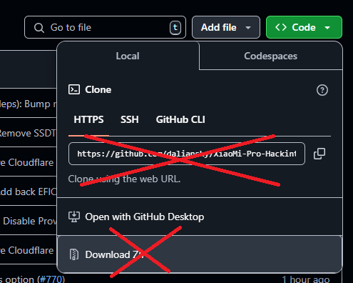

[](https://github.com/daliansky/XiaoMi-Pro-Hackintosh/actions) [](https://github.com/daliansky/XiaoMi-Pro-Hackintosh/releases/latest) [](https://github.com/daliansky/XiaoMi-Pro-Hackintosh/wiki/主页) [](https://shang.qq.com/wpa/qunwpa?idkey=d7b67735bb8c24ed2085a7ebfe0f53ce197bcc84b6397e41a3aaaaf9664966a8)
-----

[English](../README.md) | **中文**

## 目录

- [电脑配置](#电脑配置)
- [目前情况](#目前情况)
  - [Clover](#clover)
  - [OpenCore](#opencore)
- [安装](#安装)
  - [识别机型](#识别机型)
  - [首次安装](#首次安装)
  - [构建](#构建)
  - [更新](#更新)
- [改善体验](#改善体验)
- [常见问题解答](#常见问题解答)
- [更新日志](#更新日志)
- [鸣谢](#鸣谢)
- [支持与讨论](#支持与讨论)


## 电脑配置

### TM1701 和 TM1707

| 规格     | 详细信息                                     |
| -------- | ---------------------------------------- |
| 电脑型号 | 小米笔记本电脑Pro 15.6'' (MX150/GTX) |
| 处理器 | 英特尔 酷睿 i5-8250U / i7-8550U 处理器 |
| 内存 | 8GB/16GB 三星 DDR4 2400MHz |
| 硬盘 | 三星 NVMe固态硬盘 PM961 / ~~PM981~~ |
| 集成显卡 | 英特尔 超高清显卡 620 |
| 显示器 | 京东方 NV156FHM-N61 FHD 1920x1080 (15.6 英寸) |
| 声卡 | 瑞昱 ALC298 (节点: 30/99) |
| 无线网卡 | 英特尔 Wireless-AC 8265 |
| 触控板 | ETD2303 |
| SD 读卡器 | 瑞昱 RTS5129 / RTS5250S |

### TM1905 & TM1963

| 规格     | 详细信息                                     |
| -------- | ---------------------------------------- |
| 电脑型号 | 小米笔记本电脑Pro 15.6'' (MX250/MX350) |
| 处理器 | 英特尔 酷睿 i5-10210U / i7-10510U 处理器 |
| 内存 | 8GB/16GB 三星 DDR4 2666MHz |
| 硬盘 | 英特尔 SSD 660P 系列 |
| 集成显卡 | 英特尔 超高清显卡 620 |
| 显示器 | LQ156M1JW01 SHP14C3 1920x1080 344x194mm 15.5-inch |
| 声卡 | 瑞昱 ALC256 (节点: 69/~~99~~) |
| 无线网卡 | 英特尔 Wireless-AC 9462 |
| 触控板 | ELAN2303 |
| SD 读卡器 | 瑞昱 RTS5129 |


## 目前情况

- **音频** 从 macOS26.0 beta 2 (25A5295e) 开始将不工作因为缺失 `AppleHDA`
  - 用户需要使用 [OpenCore-Legacy-Patcher](https://github.com/dortania/OpenCore-Legacy-Patcher)
- **休眠** 可能会在 CML 机型上引发严重引导问题，见 [#661](https://github.com/daliansky/XiaoMi-Pro-Hackintosh/issues/661) 和 [#694](https://github.com/daliansky/XiaoMi-Pro-Hackintosh/issues/694)
  - 用户需要运行 `sudo pmset -a hibernatemode 0` 来禁用休眠模式，同时请看 [README_CML](Docs/README_CML.txt)
- **HDMI** 开机后第一次接上时可能无法工作
  - 你需要重新插拔或者关上盖子等五秒后打开盖子
- **有线网 在 macOS10.15+ 上可能无法工作，见 [#256](https://github.com/daliansky/XiaoMi-Pro-Hackintosh/issues/256)**
- 如果升级到 macOS10.15+，需要更新 [USB无线网卡驱动](https://github.com/chris1111/Wireless-USB-Adapter/releases)
  - 如果不是 macOS10.15+，也推荐更新上述驱动
- **独立显卡** 无法工作，因为 macOS 不支持 Optimus技术
  - 使用了 `SSDT-DDGPU` 来禁用它以节省电量
- **指纹传感器** 无法工作
  - 使用了 `SSDT-USB` 来禁用它以节省电量
- **英特尔蓝牙** 不支持部分蓝牙设备
  - 在 macOS12 上，英特尔蓝牙支持更多蓝牙4.x设备
  - 阅读 [蓝牙解决方案](https://github.com/daliansky/XiaoMi-Pro-Hackintosh/wiki/蓝牙解决方案)
  - 你也可以尝试 [AppleBluetooth](https://github.com/AppleBluetooth) 发布的 [IOBluetoothFixup](https://github.com/AppleBluetooth/IOBluetoothFixup)，[IntelBluetoothFamily](https://github.com/AppleBluetooth/IntelBluetoothFamily) 和 [OpenFirmwareManager](https://github.com/AppleBluetooth/OpenFirmwareManager)，请阅读 [IntelBluetoothFamily Usage](https://github.com/AppleBluetooth/IntelBluetoothFamily#usage)
- **英特尔无线网卡** 性能不佳
  - IO80211 版本**不支持** macOS Sequoia 或更高版本，请使用 [itlwm](https://github.com/OpenIntelWireless/itlwm) + [HeliPort](https://github.com/OpenIntelWireless/HeliPort) 作为替代。
  - 推荐使用 macOS 11-14；macOS 版本低于11的话需要重建缓存重启如果英特尔无线网卡不工作
  - 购买 USB网卡 或者支持的内置网卡
  - 阅读 [OpenIntelWireless/itlwm 的 Frequently Asked Questions](https://openintelwireless.github.io/itlwm/FAQ.html) 来获取详细信息
- **瑞昱USB SD读卡器** 需要额外操作来工作
  - 阅读 [0xFireWolf/RealtekCardReader 的 FAQ](https://github.com/0xFireWolf/RealtekCardReader/blob/main/Docs/FAQ.md) 来获取详细信息并添加 [RealtekCardReader](https://github.com/0xFireWolf/RealtekCardReader) + [RealtekCardReaderFriend](https://github.com/0xFireWolf/RealtekCardReaderFriend)
  - 你也可以转成使用 VMware 来让它工作，见 [2.0 Setup SD Card Reader](https://github.com/ManuGithubSteam/XiaoMi-Pro-2018-HackintoshOC/wiki/2.0-Setup-SD-Card-Reader)
- 其他都工作正常

### Clover
- TM1701 和 TM1707：支持 macOS10.15 ~ macOS15
  - **[v1.5.9](https://github.com/daliansky/XiaoMi-Pro-Hackintosh/releases/tag/v1.5.9) 是最后一个支持 macOS High Sierra & Mojave 的 EFI 版本**
- TM1905 和 TM1963：支持 macOS10.15 ~ macOS15
-----
- 使用 OpenCore 后需要清理 NVRAM
  - 在 OpenCore 启动界面按下 `空格`，选中进入 `Reset NVRAM`
  - 然后重启并使用 Clover
- r5127 不支持低于 macOS Big Sur 版本上的英特尔 Wi-Fi 因 ForceKextsToLoad 功能尚未实现（仅 [v1.4.7](https://github.com/daliansky/XiaoMi-Pro-Hackintosh/releases/tag/v1.4.7) 支持旧 macOS 版本的英特尔 Wi-Fi，或者添加 `IO80211Family.kext` 到 kext 文件夹）

### OpenCore
- TM1701 和 TM1707：支持 macOS10.15 ~ macOS26.0 beta 1 (25A5279m)
  - **[v1.5.9](https://github.com/daliansky/XiaoMi-Pro-Hackintosh/releases/tag/v1.5.9) 是最后一个支持 macOS High Sierra & Mojave 的 EFI 版本**
- TM1905 和 TM1963：支持 macOS10.15 ~ macOS26.0 beta 1 (25A5279m)
-----
- 使用 Clover 后需要清理 NVRAM
  - 在 OpenCore 启动界面按下 `空格`，选中进入 `Reset NVRAM`
- 有限的主题
- 有些人升级 Windows 11 遇到了问题，见 [#665](https://github.com/daliansky/XiaoMi-Pro-Hackintosh/issues/665)
- **推荐阅读：[Security and FileVault | OpenCore Post-Install](https://dortania.github.io/OpenCore-Post-Install/universal/security.html) 和 [OpenCore Configuration](https://github.com/acidanthera/OpenCorePkg/blob/master/Docs/Configuration.pdf)**，特别注意 **UEFI Secure Boot** 章节


## 安装

### 识别机型

如果你的机子是 小米笔记本Pro **8代** CPU，记为 **KBL**（Kaby Lake）机器。（实际为 Kaby Lake Refresh）  
如果你的机子是 小米笔记本Pro **10代** CPU，记为 **CML**（Comet Lake）机器。  
下载 [EFI release](https://github.com/daliansky/XiaoMi-Pro-Hackintosh/releases) 的时候需要用到这个信息。


### 首次安装

- 请参考详细的安装教程 [【老司机引路】小米笔记本pro Win10+黑苹果macOS 10.13.6双系统](http://www.miui.com/thread-11363672-1-1.html)，视频教程 [小米笔记本Pro(win10+Mojave10.14.3)双系统过程以及一些问题解答](http://www.bilibili.com/video/av42261432?share_medium=android&share_source=copy_link&bbid=bVk_DmoLaV48Wj4Pcw9zinfoc&ts=1555066114848)。
- 完整的EFI附件请访问 [releases](https://github.com/daliansky/XiaoMi-Pro-Hackintosh/releases) 页面。
 - 如果是日常使用，请不要克隆或者下载 main 分支。

 
 
 
 
### 构建
 
如果要构建最新测试版EFI，在终端输入以下命令：
```shell
sh -c "$(curl -fsSL https://raw.githubusercontent.com/daliansky/XiaoMi-Pro-Hackintosh/main/makefile.sh)"
```
或者在终端输入以下命令：
```shell
git clone --depth=1 https://github.com/daliansky/XiaoMi-Pro-Hackintosh.git
cd XiaoMi-Pro-Hackintosh
./makefile.sh --lang=zh_CN
```
还有一些进阶用法：
```shell
# 构建EFI时使用 Clover 和 OpenCore 引导（1. --BL=CLOVER 仅 Clover 2. --BL=OC 默认，仅 OpenCore 3. --BL=CLOVEROC 同时 Clover 和 OpenCore）
./makefile.sh --BL=CLOVEROC
# 构建EFI时使用 Debug 版 kexts 和 OpenCore
./makefile.sh --DEBUG_KEXTOC
# 忽略脚本运行时遇到的错误
./makefile.sh --IGNORE_ERR
# 使用中文版文档（1. --LANG=en_US 默认 2. --LANG=zh_CN 中文版文档）
./makefile.sh --LANG=zh_CN
# 同时生成第10代和第8代机型的EFI包（1. --MODEL=CML 仅第10代 2. --MODEL=KBL 默认，仅第8代 3. --MODEL=CMLKBL 同时第10代和第8代）
./makefile.sh --MODEL=CMLKBL
# 构建时保留工程文件
./makefile.sh --NO_CLEAN_UP
# 使用 GitHub API
./makefile.sh --GH_API
# 构建包含最新 pre-release 驱动和 OpenCore 的测试版EFI（1. --PRE_RELEASE=Kext Pre-release 驱动 2. --PRE_RELEASE=OC Pre-release OpenCore 3. --PRE_RELEASE=KextOC 同时 pre-release 驱动和 OpenCore）
./makefile.sh --PRE_RELEASE=KextOC
```


### 更新
- 如果你的机子是 小米笔记本Pro **8代** CPU，记为 **KBL**（Kaby Lake）机器。（实际为 Kaby Lake Refresh）
- 如果你的机子是 小米笔记本Pro **10代** CPU，记为 **CML**（Comet Lake）机器。
-----
- 在 [release page](https://github.com/daliansky/XiaoMi-Pro-Hackintosh/releases) 里下载最新 EFI release，或从 [action page](https://github.com/daliansky/XiaoMi-Pro-Hackintosh/actions) 的 Artifacts 里下载最新测试版 EFI release。
- 挂载 EFI 分区，首先运行命令 `sudo diskutil list` 来找到 EFI 分区所在的分区标号，然后运行命令 `sudo diskutil mount diskXsX`（X 取自你的 EFI 分区标号）
- 完整替换 `BOOT` 和 `OC`(或 `CLOVER`)文件夹。首先删除他们，然后从 [release 包里](https://github.com/daliansky/XiaoMi-Pro-Hackintosh/releases)拷贝新的。


## 改善体验

- 使用 [Hackintool](https://github.com/headkaze/Hackintool) 来注入 EDID（AAPL00,override-no-connect）
- 更改 `config.plist` 中的 `#enable-backlight-smoother` 为 `enable-backlight-smoother` 使亮度调节变得更丝滑
- 使用 [xzhih](https://github.com/xzhih) 的 [one-key-hidpi](https://github.com/xzhih/one-key-hidpi) 来提升系统 UI 质量
  - 支持 1424x802 HiDPI 分辨率
  - TM1701：如果 macOS 版本高于 10.13.6，要开启更高 HiDPI 分辨率 (不能超过 1520x855)，请先使用 [DVMT_and_0xE2_fix](../BIOS/TM1701/DVMT_and_0xE2_fix) 来把动态显存设为64mb
- 开启 `AppleVTD` 通过修改 OEM `DMAR` 表，参考 [How to Fix DMAR Table on macOS | Memory Mapping](https://elitemacx86.com/threads/how-to-fix-dmar-table-on-macos-memory-mapping.964/)；经测试每次升级 BIOS 后须重新定制
- 添加 `forceRenderStandby=0` 到 `config - NVRAM - Add - 7CXXX - boot-args` (OpenCore) 或 `config - Boot - Arguments` (Clover) 如果出现 NVMe Kernel Panic CSTS=0xffffffff
- 使用 [NVMeFix](https://github.com/acidanthera/NVMeFix) 来开启 NVMe SSDs 的 APST
- TM1701 和 TM1707：使用 [ALCPlugFix](../ALCPlugFix) 来修复耳机重新插拔后无声
- TM1701：使用 [DVMT_and_0xE2_fix](../BIOS/TM1701/DVMT_and_0xE2_fix) 来开启 4K 外接显示屏并获得更加“原生”的电源管理
- TM1905 和 TM1963：如果 macOS 版本等于 13.4，更改 `enable-backlight-registers-fix` 为 `enable-backlight-registers-alternative-fix`


## 常见问题解答

#### 我无法用触控板按下并拖拽或右击。

从 [VoodooI2C v2.4.1](https://github.com/alexandred/VoodooI2C/releases/tag/2.4.1) 开始，按下手势会被仿冒为用力点按，导致无法按下并拖拽文件或右击。你可以在 `系统偏好设置 - 触控板` 里关闭 `用力点按` 并建议在 `系统偏好设置 - 辅助功能 - 指针控制 - 触控板选项` 里开启 `三指拖移`。

#### 在升级过程中显示器黑屏并且机子无反应。

如果显示器持续黑屏并且无反应超过五分钟，请强制重启电脑(长按电源键)并选择 `Boot macOS Install from ~` 启动项。

#### 卡在白苹果图标或者无法启动。

建议重置 NVRAM。如果是 Clover 用户，在 Clover 开机界面按下 `Fn+F11`。  
如果是 OC 用户，在 OpenCore 开机界面按下 `空格` 键并选择 `Reset NVRAM`。如果仍不奏效，可以尝试打开 `config.plist`，并把 `SecureBootModel` 设置为 `Disabled`。

#### 收不到 OEM 系统更新。

如果是 OC 用户，在 macOS11+，`SecureBootModel` 需要设置为 `Default` 来获取系统偏好设置中的 OEM 系统更新。然而，当 `SecureBootModel = Default` 时，一些机器无法启动。这种情况下，前往 `App Store` 并搜索 `Monterey（或者更新系统）`。

#### 我的设备被 `查找我的Mac` 锁住了，无法开机，怎么办？

如果是 Clover 用户，在 Clover 开机界面按下 `Fn+F11`。然后 Clover 会刷新 `nvram.plist` 并移除锁定信息。  
如果是 OC 用户，开机时按 `Esc` 键来进入引导菜单。然后按下 `空格` 键并选择 `Reset NVRAM`。

#### [Clover] 我开启了 `文件保险箱`，开机时找不到 macOS 启动项，怎么办？

一般情况下不推荐开启 `文件保险箱`。你可以在 Clover 开机界面时按下 `Fn+F3`，然后选择下方小字含有 `FileVault` 的苹果图标。进入系统后关闭 `文件保险箱`。

#### [OC] 怎么跳过引导菜单并直接进入系统？

首先，在macOS系统里打开 `系统偏好设置 - 启动磁盘`，选择要直接进入的系统。  
然后，打开 `/EFI/OC/config.plist`，关闭 `ShowPicker`。  
想切换系统的时候，开机时按 `Esc` 键来进入引导菜单。

#### [OC] 怎么取消 OpenCore 默认启动项？

打开 `config.plist` 并修改 `LauncherOption` 值，原本为 `Full`，改成 `System`。

#### [OC] 怎么开启启动音？（TM1701 & TM1707）

开启 `config.plist - UEFI - Drivers` 中的 `AudioDxe.efi`。  
开启 `config.plist - UEFI - Audio` 中的 `AudioSupport`。  
如果你在使用 macOS Big Sur，请前往 `系统偏好设置 - 声音` 并勾选 `启动时播放声音`。  
如果在使用低于 Big Sur 的 macOS 版本，请打开 `终端.app` 并运行 `sudo nvram StartupMute=%00`。

### 更多问题解答请前往 [常见问题解答](https://github.com/daliansky/XiaoMi-Pro-Hackintosh/wiki/常见问题解答)。


## 更新日志

详细更新日志请看 [更新日志中文版](Changelog_CN.md)。


## 鸣谢

- 感谢 [0xFireWolf](https://github.com/0xFireWolf) 提供 [RealtekCardReader](https://github.com/0xFireWolf/RealtekCardReader) 和 [RealtekCardReaderFriend](https://github.com/0xFireWolf/RealtekCardReaderFriend)。
- 感谢 [Acidanthera](https://github.com/acidanthera) 提供 [AppleALC](https://github.com/acidanthera/AppleALC)，[BrcmPatchRAM](https://github.com/acidanthera/BrcmPatchRAM)，[HibernationFixup](https://github.com/acidanthera/HibernationFixup)，[Lilu](https://github.com/acidanthera/Lilu)，[NVMeFix](https://github.com/acidanthera/NVMeFix)，[OpenCorePkg](https://github.com/acidanthera/OpenCorePkg)，[RestrictEvents](https://github.com/acidanthera/RestrictEvents)，[VirtualSMC](https://github.com/acidanthera/VirtualSMC)，[VoodooInput](https://github.com/acidanthera/VoodooInput)，[VoodooPS2](https://github.com/acidanthera/VoodooPS2) 和 [WhateverGreen](https://github.com/acidanthera/WhateverGreen)。
- 感谢 [agasecond](https://github.com/agasecond) 和 [htmambo](https://github.com/htmambo) 针对10代机型的宝贵建议。
- 感谢 [apianti](https://sourceforge.net/u/apianti)，[blackosx](https://sourceforge.net/u/blackosx)，[blusseau](https://sourceforge.net/u/blusseau)，[dmazar](https://sourceforge.net/u/dmazar) 和 [slice2009](https://sourceforge.net/u/slice2009) 提供 [Clover](https://github.com/CloverHackyColor/CloverBootloader)。
- 感谢 [daliansky](https://github.com/daliansky) 提供 [OC-little](https://github.com/daliansky/OC-little)。
- 感谢 [FallenChromium](https://github.com/FallenChromium)，[jackxuechen](https://github.com/jackxuechen)，[Javmain](https://github.com/javmain)，[johnnync13](https://github.com/johnnync13)，[IlikemacOS](https://github.com/IlikemacOS)，[ManuGithubSteam](https://github.com/ManuGithubSteam)，[MarFre22](https://github.com/MarFre22)，[Menchen](https://github.com/Menchen)，[Pasi-Studio](https://github.com/Pasi-Studio)，[qeeqez](https://github.com/qeeqez) 和 [williambj1](https://github.com/williambj1) 针对8代机型的宝贵建议。
- 感谢 [hieplpvip](https://github.com/hieplpvip) 和 [syscl](https://github.com/syscl) 提供 DSDT 补丁样本。
- 感谢 [OpenIntelWireless](https://github.com/OpenIntelWireless) 提供 [AirportItlwm](https://github.com/OpenIntelWireless/itlwm) 和 [IntelBluetoothFirmware](https://github.com/OpenIntelWireless/IntelBluetoothFirmware)。
- 感谢 [RehabMan](https://github.com/RehabMan) 提供 [OS-X-Clover-Laptop-Config](https://github.com/RehabMan/OS-X-Clover-Laptop-Config)。
- 感谢 [RehabMan](https://github.com/RehabMan) 和 [Sniki](https://github.com/Sniki) 提供 [EAPD-Codec-Commander](https://github.com/Sniki/EAPD-Codec-Commander)。
- 感谢 [RehabMan](https://github.com/RehabMan) 和 [stevezhengshiqi](https://github.com/stevezhengshiqi) 提供 [OS-X-Null-Ethernet](https://github.com/stevezhengshiqi/OS-X-Null-Ethernet)。
- 感谢 [VoodooI2C](https://github.com/VoodooI2C) 提供 [VoodooI2C](https://github.com/VoodooI2C/VoodooI2C)。

### 请前往 [参考](https://github.com/daliansky/XiaoMi-Pro-Hackintosh/wiki/参考) 来获取更多内容。


## 支持与讨论

其他项目维护的小米笔记本系列：
  * [小米游戏笔记本](https://github.com/johnnync13/XiaomiGaming) by [johnnync13](https://github.com/johnnync13)
  * [小米笔记本Air-12.5-6y30](https://github.com/johnnync13/EFI-Xiaomi-Notebook-air-12-5) by [johnnync13](https://github.com/johnnync13)
  * [小米笔记本Air-12.5-7y30](https://github.com/influenist/Mi-NB-Gaming-Laptop-MacOS) by [influenist](https://github.com/influenist)
  * [小米笔记本Air-13.3-第一代](https://github.com/johnnync13/Xiaomi-Notebook-Air-1Gen) by [johnnync13](https://github.com/johnnync13)
  * [小米笔记本Air-13.3-2018](https://github.com/johnnync13/Xiaomi-Mi-Air) by [johnnync13](https://github.com/johnnync13)

tonymacx86.com:
  * [[Guide] Xiaomi Mi Notebook Pro High Sierra 10.13.6](https://www.tonymacx86.com/threads/guide-xiaomi-mi-notebook-pro-high-sierra-10-13-6.242724)

QQ群:
  * 247451054 [小米PRO黑苹果高级群](http://shang.qq.com/wpa/qunwpa?idkey=6223ea12a7f7efe58d5972d241000dd59cbd0260db2fdede52836ca220f7f20e)
  * 137188006 [小米PRO黑苹果](http://shang.qq.com/wpa/qunwpa?idkey=c17e190b9466a73cf12e8caec36e87124fce9e231a895353ee817e9921fdd74e)
  * 689011732 [小米笔记本Pro黑苹果](http://shang.qq.com/wpa/qunwpa?idkey=dde06295030ea1692d6655564e392d86ad874bd0608afd7d408c347d1767981b)
